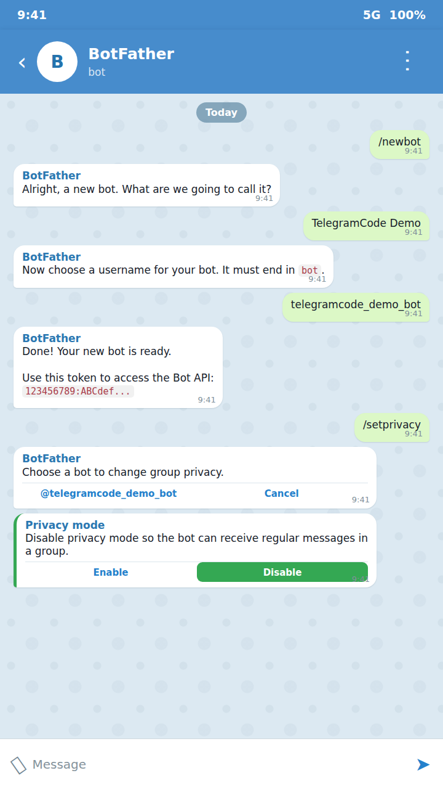
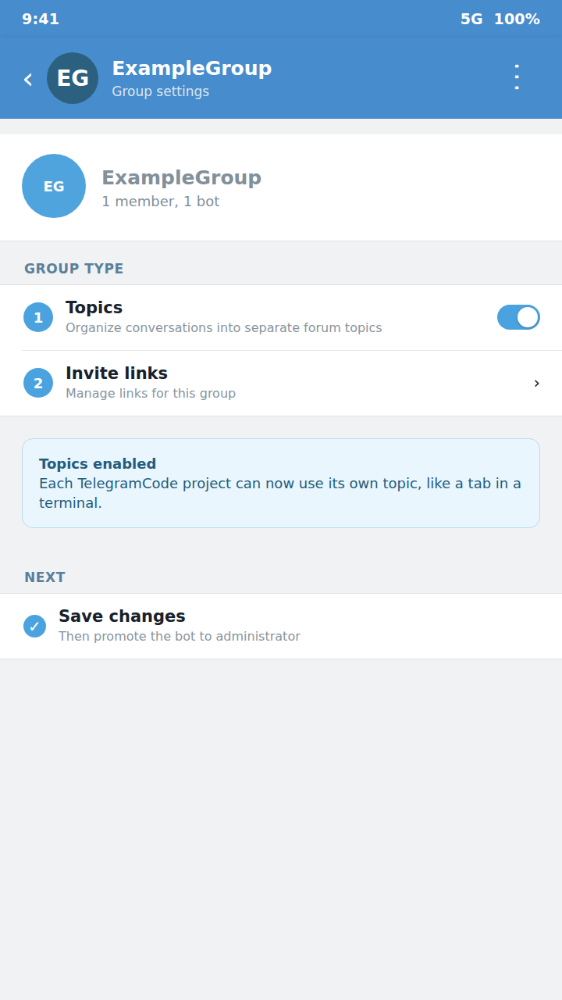
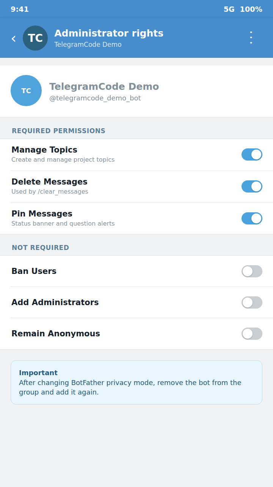
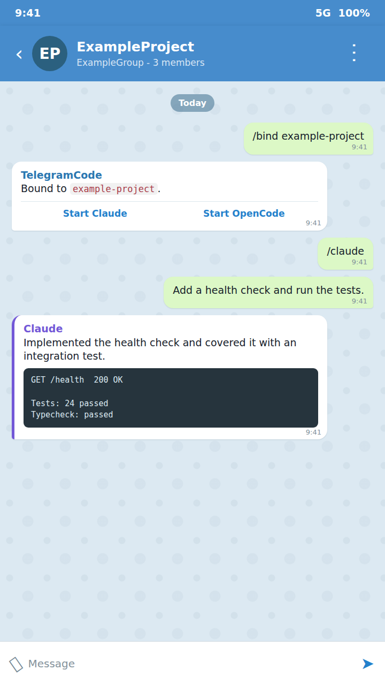

<h2 align="center">Telegram bot/group as a terminal for OpenCode, Claude Code — every thread like a terminal tab + scheduling, voice control</h2>

<p align="center">
  
</p>

TelegramCode turns Telegram into a terminal for running agentic CLIs. Open as
many tabs as you need — even two on the same project for parallel work — and
drive the agents from your phone or tablet, voice messages included.

Think **OpenClaw for vibe coding**, driven entirely from Telegram: no complex
setup, no extra dashboards — direct access to your own **OpenCode** /
**Claude Code** running on your machine or server.

### Features

- **Simple setup & management** — install the CLI, put your bot token in one `.env`, bind a topic to a folder, and run; everything after is managed from Telegram — no dashboards
- **Multi-thread / topic** — one topic per directory with your agent; two topics can share one folder for parallel work — run almost unlimited agents in parallel
- **Two chat surfaces** — forum-group topics and the owner's bot DM, both served at once by default, with tabs on either
- **Agent backends** — OpenCode (native server API over HTTP+SSE) and Claude Code (two backends — tmux and json-stream)
- **Raw terminal** — `/terminal` binds a topic to a real `$SHELL` in the project folder
- **Notifications** — when the agent asks a question, the bot pins that message so even a muted topic notifies you: the pin pierces mute, giving exactly one notification per question (unpinned once you answer)
- **Scheduled & self-driving runs** — `/schedule` arms cron / one-shot / N-times jobs per topic, and the agent can schedule *itself* via injected MCP tools: nightly reviews, recurring reports, a "finish this tomorrow at 9" hand-off. Each job fires as a fresh session with your prompt; restart-safe, with one catch-up for a run missed while the bot was down
- **Inbound files** — photos / documents / video / audio sent to a topic are saved and announced to the agent; albums arrive as one prompt
- **Outbound files** — the agent sends files back to you — a generated chart, a screenshot, a log, a rendered PDF — single files or albums, straight into the topic
- **Voice input** — Whisper transcription via Groq (preferred) or OpenAI
- **Display verbosity** — `/verbosity` (plus `/thinking`, `/tool_results`, `/subagent`) per topic: `minimal|short|full`
- **Time-aware prompts** — `/timestamps on` prepends each forwarded prompt's send time (local-offset ISO), so a days-long session knows what "yesterday" or "2 days ago" means; agent-facing only, per topic
- **Reply context** — reply to a message in a topic and the quoted text is folded into the prompt the agent receives, so it sees what you point at without re-pasting; works for text and voice, both agents
- **Your timezone** — `/timezone Europe/Moscow` once, and schedules fire at your wall-clock time while the agent is told what time it actually is; no server-clock guessing

## Two surfaces: group topics, bot DM, or both

The bot serves two Telegram surfaces:

- **Forum supergroup** — every topic is a tab. The most familiar UX: a visible
  topic list, per-topic names and icons, quick switching between agents. The
  trade-off is Telegram's group throughput cap (about 20 messages/min per
  group), so the bot paces and coalesces heavy output streams.
- **The bot's own DM** (owner only) — the private
  chat runs in topic mode too, so you get the same thread-per-agent tabs
  there, and live output streams through Telegram's native draft "cursor":
  the reply grows in place in one message instead of arriving as a flood of
  separate messages.

## Where to run the bot server

The bot runs anywhere the agent CLIs run:

- **Your own working machine** — the simplest start: launch `telegramcode`
  from your projects parent folder and your laptop/desktop becomes the
  backend. The catch: agents are only reachable while the machine is on and
  awake.
- **A remote server (cloud VPS/VDS or bare metal)** — the more convenient
  setup: organize your working environment there once (git + your repos,
  Claude Code / OpenCode, `telegramcode`) and you get an always-on dev box you
  drive from any device through Telegram — phone, tablet, voice. When picking
  one, a bare-metal server without virtualization beats a virtualized VPS/VDS:
  its NVMe drives are usually much faster, which matters once you also build
  and run a dev server there, not just the agents. Classic terminal access to
  the very same Claude sessions stays available over SSH — run plain `claude`
  in the project folder: it reads the same `~/.claude/projects/<cwd-slug>/`
  session store the bot uses, so a session started in a Telegram thread can
  be picked up in the terminal and vice versa.

## Quick Start

Five steps: install the CLI, create a bot, (optionally) set up a group, launch
from your projects folder, bind a topic to an agent.

> **[manual]** tags a step you must do by hand in the Telegram app — an agent
> running on the host can't do it for you. Everything unmarked is a host-side
> command (or file edit) that can be automated.

### 1. Install the CLI

```bash
npm install -g telegramcode      # needs Node ≥ 22
```

This registers the `telegramcode` command. Prefer containers, or want two isolated instances on one
host? Use [Run with Docker](#run-with-docker) instead — every other step is the
same. To hack on the bot itself, see [Run from source](#run-from-source).

### 2. Create the bot

**[manual]** In Telegram, with @BotFather:

1. Message [@BotFather](https://t.me/BotFather), send `/newbot`, follow prompts.
2. Save the token (`123456789:ABCdef...`).
3. **Disable privacy mode** — same chat: `/setprivacy` → pick this bot →
   `Disable`. Without this the bot only sees `/commands`, not free-form text.

<p></p>

Put the token where the bot reads it — the global config `.env`:

```bash
mkdir -p ~/.config/telegramcode
$EDITOR ~/.config/telegramcode/.env
```

```dotenv
# ~/.config/telegramcode/.env — the one place your keys live
TELEGRAM_BOT_TOKEN=123456789:ABCdef...
# GROQ_API_KEY=...     # optional: free voice transcription
# OWNER_USER_ID=...    # set to drive the bot from its DM (step 3)
```

All keys the bot needs live in this one file — the bot token and the optional
`GROQ_API_KEY` for voice sit side by side, no separate stores. (Agent
provider auth is the exception, and lives inside the agents themselves:
`claude login` for Claude, `/connect` or OpenCode's own config for OpenCode —
see [Environment Variables](#environment-variables).) The wrapper loads env
from two locations, in order — a global base and an optional per-project
override:

1. `~/.config/telegramcode/.env` — base, set once, used everywhere.
2. `$PWD/.env` — per-project tweaks (last write wins).

The full annotated template is `.env.example` (shipped with the package and in
the repo).

### 3. Set up a group (optional) or DM

The bot serves a **forum supergroup**, the **owner's private chat (DM)**, or
both at once (`CHAT_MODE`, default `both`). The group is the nicest UX — a
visible topic list, per-topic names/icons, quick agent switching — but it is
**optional**: with `OWNER_USER_ID` set you can run entirely from the bot's DM.

**To use a group (recommended)** — **[manual]**, all in the Telegram client:

1. In a Telegram client: `New Group` → name it → add the bot.
2. Open group settings → enable **Topics** (Forum mode).
3. Promote the bot to admin with these rights:
   - `Manage Topics` (required — bind/create threads)
   - `Delete Messages` (for `/clear_messages`)
   - `Pin Messages` (per-thread status banner + question alerts; `/doctor`
     warns if missing, but the bot still runs without it)
4. **Remove the bot from the group and add it again.** Telegram caches the
   privacy-mode flag on join; without re-adding, the bot keeps private-mode and
   ignores free-form messages (see
   [Troubleshooting → Bot doesn't see text](#bot-doesnt-see-text)).

<p>
  
  
</p>

The group **id is automatic** — leave `ALLOWED_GROUP_ID` empty and the bot
auto-pairs with the first forum supergroup an admin talks to it from (the
`-100…` id is saved to `state.json`; re-point later with `/pair`). To pin a
specific id by hand, set `ALLOWED_GROUP_ID` to the numeric value (a group
**name** is not accepted) — that also disables auto-pairing. **Access control:**
whoever is a creator/administrator of that group may drive the bot — there is no
separate allow-list.

**To use the DM instead (or as well):** **[manual]** send `/start` to
[@userinfobot](https://t.me/userinfobot) for your numeric user id, then add it
(host-side) to the same `.env`:

```dotenv
OWNER_USER_ID=987654321
```

With the default `CHAT_MODE=both`, an unset `OWNER_USER_ID` just leaves the DM
surface inert (group-only); set it and the DM lights up alongside the group. Use
`CHAT_MODE=dm` to skip the group entirely.

### 4. Launch from your projects folder

```bash
cd ~/projects && telegramcode
```

That `$PWD` — the parent folder holding your repositories — is the folder the
bot works in; each topic binds to a subfolder under it. There's nothing else to
configure for it. A single-instance lockfile (`$DATA_DIR/instance.lock`) stops a
second bot starting under the same user; stale locks (after `kill -9`) are
reclaimed automatically.

### 5. Bind a topic and talk to an agent

This step is **[manual]** — it all happens inside the Telegram app.

**In the group:**

1. Open the group; in the General topic send `/ls` — the bot lists subfolders
   under the work root.
2. Create a topic (the `+` button).
3. In the new topic: `/bind <subdir>` (auto-bound if the topic name matches a
   subdir).
4. `/claude` or `/opencode` → talk to the agent (text or voice).

<p></p>

**In the DM:** the same commands, one thread per agent — `/ls`,
`/bind <subdir>`, then `/claude` or `/opencode`.

Then: `/quit` ends the session; bare `/bind` inspects/reconfigures the binding;
`/clear_messages` deletes the topic's bot messages.

> **Continue the same session from a terminal.** No wrapper needed: run
> `claude --dangerously-skip-permissions` in the project folder. It is the same
> binary and the same `~/.claude/projects/<cwd-slug>/` session store the bot
> uses, so a thread started in Telegram can be picked up with `claude --resume`
> and vice versa.

### Run with Docker

Skip the global install and run in containers instead:

```bash
git clone https://github.com/olosegres/telegramcode
cd telegramcode/examples
cp .env.example .env       # edit values
docker compose up -d
```

The compose file ships **two services** — `telegramcode-pet` and
`telegramcode-work`. If you only need one, comment out the other or copy just
the block you want. The pair is set up so they cannot collide (separate tokens,
groups, data volumes, opencode ports — see
[Two instances on one host](#two-instances-on-one-host)).

### Run from source

To hack on the bot itself:

```bash
git clone https://github.com/olosegres/telegramcode && cd telegramcode
yarn install && yarn build
npm install -g .            # registers the `telegramcode` command
```

Shortcut: `yarn install-link` runs `yarn install && yarn build && npm link` in
one shot — `npm link` symlinks the global `telegramcode` to this folder, so
later rebuilds (`yarn build`) are picked up without re-installing. Config and
launch are identical to steps 2–5 above.

## Required files structure

Launch `telegramcode` from the parent folder that holds your project repos —
that `$PWD` is the work root, and every topic binds to a subfolder under it:

```
$PWD=/home/user/src                     ← run the bot here ($PWD = work root)
├── projectA/         ← Topic "projectA"        (claude)
├── projectB/         ← Topic "projB-frontend"  (claude)
│                     ← Topic "projB-backend"   (opencode)   ← one folder, two topics
│                     ← Topic "projB-refactor"  (claude)
└── projectC/         ← Topic "projectC"         (opencode)

Telegram forum supergroup
├── Bot is admin with can_manage_topics + can_delete_messages + can_pin_messages
└── Routes each topic by (chatId, threadId) → remembered in state.json
```

**What the bot remembers (`state.json`).** So a restart is seamless, the bot
saves which topic is bound to which folder, each topic's live agent session (to
re-attach it after a reboot), your per-topic preferences (agent, model,
reasoning effort, language, display verbosity), scheduled prompts, and the
paired group id. This file lives in `DATA_DIR` (default `~/.telegramCode`) and
is written safely, so a crash can't corrupt it.

## Commands

### In any topic

Most commands work in any topic; a binding (`/bind`) is required only to
actually start an agent or terminal in the folder.

| Command | Description |
|---|---|
| `/claude`, `/opencode`, `/oc` | Start agent in this topic's bound folder |
| `/terminal` | Open a raw `$SHELL` in the bound folder — see [Raw terminal](#raw-terminal-terminal) |
| `/claude_mode` | Switch this topic's Claude backend (tmux-scrape ⇄ json-stream); bare shows a picker — see [Claude Code backends](#claude-code-backends-claude_mode) |
| `/model` | Switch model through a two-level picker: providers, then that provider's models (10 per page). Each provider row has a 🙈 to hide it from the picker (bot-wide, persisted; 👁 brings it back) — `/model <provider/model>` still reaches a hidden provider. If OpenCode is waiting on an old provider's retry, the next prompt interrupts that wait and starts with the selected model instead of sitting queued behind it |
| `/connect [provider]` | Connect an OpenCode provider (OpenAI by default; for example `/connect openrouter`). Special OAuth methods are shown when available; ordinary catalog providers ask for an API key and delete the key message from Telegram |
| `/disconnect [provider]` | Remove an OpenCode provider's stored credentials; bare shows a picker of active providers. A provider OpenCode enables from an environment variable (e.g. `OPENROUTER_API_KEY`) stays active after this — the reply says so and points at hiding it in `/model` |
| `/effort` | Set reasoning effort (per-thread) via inline buttons. Claude: native `/effort` levels (`low…ultracode`). OpenCode: the current model's variants, applied per-prompt. No env configuration |
| `/verbosity` | Output-verbosity macro (`minimal\|short\|full`): sets the thinking, tool-results and sub-agent display prefs at once; `/thinking`, `/tool_results`, `/subagent` point-override afterwards. Mixed prefs show as "custom" in the picker |
| `/thinking` | Chain-of-thought display: `full` keeps the reasoning, `short` collapses to "💭 thought for Ns", `minimal` keeps only the live working cue |
| `/tool_results` | Completed tool-call output: `full` whole body, `short` capped (15 lines / 1200 chars), `minimal` transient 🔧 status only |
| `/subagent` | Sub-agent transcript: status-only with a ticking elapsed counter (`minimal`/`short`), or streamed "🤖 ⤷" chunks (`full`) |
| `/sessions` | List & resume previous sessions in this folder |
| `/rename_session` | Rename the current live session (OpenCode; Claude transcripts have no title) |
| `/quit`, `/q` | End the session — Claude: graceful double Ctrl+C; OpenCode/terminal: `stopSession`. Releases the persisted session id, so a bot restart won't auto-reattach it (resume later via `/sessions`) |
| `/new`, `/clear_session` | End the current session and start a fresh one (same adapter) |
| `/status` | This thread's status: agent, bound folder and resolved workdir; a live session also shows the model it is actually running, effort, start time, runtime version and context use (anything the backend cannot report renders as unknown) |
| `/output` | Last 500 lines of agent output (sent as at most 5 chunks; the overflow is reported as omitted) |
| `/c`, `/y`, `/n` | Ctrl+C / "y" / "n" |
| `/enter`, `/up`, `/down`, `/tab` | tmux key passthrough |
| `/esc`, `/escape` | Send a raw Escape — interrupt the current turn / dismiss a selector |
| `/schedule` | Schedule a prompt in free text — the agent parses the time and owns the job; see [Scheduler](#scheduler-schedule) |
| `/clear_messages` | Delete bot messages in this topic (up to 48h, Telegram limit) |
| `/clear` | Forwarded to the agent (Claude wipes context; OpenCode plain text) — not a bot command anymore. Also purges the topic's file-intake dir |
| `/compact` | Compact the agent's context — a real, confirmed compaction on OpenCode and on the default (stream) Claude backend; the tmux Claude backend has the literal command forwarded (its TUI compacts); terminal: not supported |
| `/compact_on_idle` | Toggle auto-compaction after ~55 min idle (Enable/Disable picker). Per topic; run it in **General** to set the default for all topics. On by default. The bot posts a short notice + a "where we stopped" recap after each idle compaction. Fires at most once per active period (until you write again); if a question was pending it is re-asked with tappable buttons after the compaction |
| `/bind` | Bare: current binding + folder picker, with «leave current dir» (the old `/unbind`) and «create new folder» buttons |
| `/mcp` | List MCP servers active for this thread |

### Info / ops (work anywhere)

| Command | Description |
|---|---|
| `/start` | Intro: work root + available agents |
| `/help` | Context-aware help |
| `/ls` | List the project subfolders of the folder the bot was launched from |
| `/list` | List existing topics and their bindings |
| `/status` | This topic's status; in General — a global view of all topics + active agents. A live non-General topic also reports the resolved workdir, the model actually running, runtime version and context use (unknown when the backend cannot report it) |
| `/doctor` | Self-diagnose: admin rights, privacy mode, paths, CLIs |
| `/version` | Versions: bot, claude, opencode, node, tmux |
| `/whoami` | Show userId, chatId, threadId, isAllowed, binding |
| `/trace` | Output-trace recorder (`on`/`off`, `on all`/`off all`; bare = status) — see [Observability](#observability) |
| `/timestamps` | Prepend the send time to prompts forwarded to the agent (`on`/`off`; bare = status) |
| `/language`, `/lang` | Set the bot UI language for this chat; bare opens an endonym picker (sorted A→Z by English name), `/language auto` returns to automatic per-chat detection |
| `/timezone` | Set the timezone every clock the bot touches speaks in — schedules, agent time context, time renders. `/timezone Europe/Moscow`, `/timezone +04:00`, `/timezone auto` (host zone); bare opens a region → zone picker. Instance-wide, not per chat |
| `/pair` | Bind this forum supergroup to the bot (re-point auto-pairing) — works from any topic of the target group; a numeric `ALLOWED_GROUP_ID` env locks pairing |

### General-only

| Command | Description |
|---|---|
| `/quit-all`, `/quitall` | End every active agent in every bound topic (also releases their session ids) |

### Natural language

In a bound topic you can also type:
- `claude fix the bug` / `opencode add tests`
- A plain message after `/claude` is already running → routed as input.

Voice messages are transcribed via Groq Whisper (free) or OpenAI Whisper
(fallback) and follow the same routing.

`/terminal` is never started from a natural-language phrase — only the
explicit command opens a shell.

## Claude Code backends (`/claude_mode`)

"Claude Code" in a topic is one user-facing choice with two interchangeable
backends:

- **json-stream** (`/claude_mode json`) — `claude -p` in stream-json mode as
  an external tmux-hosted process emitting structured events. Cleaner
  output, and it survives bot restarts (the bot re-adopts the process and
  replays what was produced during the downtime). The **default**.
- **tmux-scrape** (`/claude_mode tmux`) — the classic TUI driven by
  keystrokes inside tmux; output is scraped from the pane.

`/login` works on both backends. tmux-scrape hosts the sign-in inside its
TUI; json-stream (which has no TUI) runs it **out-of-band** — the bot spawns
`claude auth login` in a pty, posts the sign-in link into the topic, and takes
your pasted code back (the code message is deleted and a 🔐 confirmation is
posted).

Both backends drive the same `claude` CLI against the same on-disk
transcript, so `/claude_mode` switches a live topic seamlessly — the
conversation resumes on the other backend. The pick persists per topic
(▶️ Claude and `/claude` reopen it). Billing note: the json-stream backend
strips `ANTHROPIC_API_KEY` from the agent's env, so usage bills to your
Claude subscription rather than an API key.

## Scheduler (`/schedule`)

A topic can have scheduled prompts: at fire time the bot posts the prompt
into the topic, pins the announcement (pins accumulate as run history),
waits for a busy agent to go idle (up to 10 min, rather than interrupting
live work) and delivers it — reusing the active session or starting one
with the thread's last-used backend.

- `/schedule <free text>` is a thin wrapper — the bot owns no date parsing.
  The agent interviews you (bare `/schedule`) or parses "every day at 9" /
  "tomorrow 15:00" itself, then calls the bot-injected `schedule_create` /
  `schedule_list` / `schedule_cancel` MCP tools (cron, one-shot, or
  N-times; min interval 5 min; up to 30 jobs per topic).
- Restart-safe: timers re-arm at boot; a run missed during downtime fires
  one catch-up annotated with the missed time.
- Leaving a folder pauses the topic's jobs; `/bind` resumes them (an
  expired one-shot is dropped). Run history:
  `DATA_DIR/scheduler-runs.jsonl`.

## Raw terminal (`/terminal`)

`/terminal` binds the topic to a real interactive `$SHELL` (in tmux) in the
bound folder — a third backend alongside the agents, mutually exclusive
with them. Every plain message is typed in as a command; output streams
back as one rolling message per command. Raw keys reuse the TUI commands:
`/c` (Ctrl-C), `/up` `/down` (history), `/tab` (completion), `/enter`.
Restart-safe like the agents: the shell survives a bot restart and is
re-adopted. Known v1 limitation: full-screen TUIs (vim, htop, less) render
messy; normal commands, builds, and logs stream cleanly. The shell comes
from the `SHELL` env (fallback `/bin/bash`).

## File intake

Send a file to a bound topic with an active agent and the bot hands it to
the agent:

- Six kinds: photo, document (incl. PDF), video, video note, audio,
  animation. Voice is **not** intake — it stays on the transcription path.
- The file is downloaded to `DATA_DIR/files/<chatId>_<threadId>/`
  (bot-owned, never inside your project folder) and announced to the agent
  as `[Telegram file] … saved to: <path>` plus your caption.
- A media album (several files sent as one message) is batched into ONE
  combined `[Telegram album]` prompt instead of N separate ones.
- Limits and cleanup: 20 MB per file (Telegram Bot API cap); forwarding a
  bare `/clear` purges the topic's intake dir (the agent's context is gone,
  so the files are useless); files older than 30 days are swept daily.

## Observability

- **Output trace** — ON by default for every thread: each incoming update,
  adapter emit, and outgoing Bot API call (with outcome, incl. 429 details)
  is recorded into hourly buckets `DATA_DIR/output-trace-*.jsonl` (pruned
  after 6h). `/trace off all` turns it off durably; bare `/trace` reports
  status. This is the source of truth when debugging "a message never
  reached the topic".
- **Console tee** — the bot's stdout/stderr is mirrored to
  `DATA_DIR/bot-console-*.log` (same hourly buckets, same 6h prune), so
  boot logs stay readable post-incident without the operator's terminal.
- **`/timestamps on`** — prepends each forwarded prompt's send time
  (local-offset ISO) so a days-long session knows what "yesterday" means.
  Agent-facing only, default off, persisted per topic.

## Timezone

The bot runs on the host clock, which on a typical server is UTC. `/timezone`
declares yours ONCE, instance-wide, and every clock the bot touches follows:

- **Schedules** fire at your wall-clock time. Changing the zone PRESERVES the
  wall clock — "9am" stays 9am rather than drifting by the offset — and every
  job's next run is recomputed on the spot (an expired one-shot is dropped).
- **The agent** is told the current time and zone with each `/schedule` request,
  and carries the zone in its thread-context preamble, so "remind me tomorrow at
  9" resolves against your clock instead of the model's assumption.
- **Time renders** — "missed at HH:MM", schedule descriptions, `/timestamps`
  injection and the `schedule_list` next-run stamp all read in your zone.

```
/timezone Europe/Moscow     # IANA name
/timezone +04:00            # fixed offset (accepted; does not follow DST)
/timezone                   # region → zone picker
/timezone auto              # back to the host zone
```

The current zone and its wall clock also show in `/status`. Nothing is stored
until you set one, so an install that never runs `/timezone` behaves exactly as
it did before.

## Environment Variables

### Set Before Launch

| Variable | Description |
|---|---|
| `TELEGRAM_BOT_TOKEN` | Token from @BotFather |

Start from the parent folder containing your projects: `cd ~/projects && telegramcode`.
That `$PWD` is the folder the bot works in — nothing else to set for it.

**Access control.** There is no user allow-list. Whoever is a **creator or
administrator of the served forum group** may talk to the agent — read live from
Telegram (`getChatAdministrators`) and cached for 1h. Promote someone in the
group to grant access; demote/remove them to revoke it — the bot subscribes to
`chat_member` updates, so an admin change invalidates the cache and takes
effect immediately (the 1h TTL is only the fallback). The bot must be a group
admin itself (it already needs that to create topics and pin). Anonymous admins
can't be matched from their messages, so post non-anonymously. The DM surface
(when enabled) is gated separately: only the configured `OWNER_USER_ID` may
talk to the bot there.

> **Security model — group admin (or the DM owner) ⇒ shell on the host.** The agents run with
> permission checks disabled (`--dangerously-skip-permissions` for Claude,
> auto-approve for OpenCode) and `/terminal` opens a raw `$SHELL` in the bound
> folder, so anyone who can talk to the bot can execute arbitrary commands as
> the bot's OS user. Only promote people you would trust with SSH access to
> that machine, and keep the served group itself private.

### External Optional

| Variable | Default | Description |
|---|---|---|
| `ALLOWED_GROUP_ID` | (auto-pair) | Numeric forum supergroup id (`-100…`). Leave empty to auto-pair with the first forum group a group **admin/creator** contacts the bot from (id is saved to `state.json`; re-point with `/pair`). A **name** is not accepted. A numeric value disables auto-pairing |
| `DATA_DIR` | `~/.telegramCode` | Per-instance state. **Mandatory** if you run two bots on the same host — otherwise both share `state.json` and `mcp.json` and corrupt each other |
| `CHAT_MODE` | `both` | Which surface(s) this instance serves: `group`, `dm`, or `both` — see [Two surfaces](#two-surfaces-group-topics-bot-dm-or-both) |
| `OWNER_USER_ID` | — | **Optional.** Numeric Telegram user id of the owner — leave it unset to run group-only (the DM surface stays inert; a group works fully without it). Set it only to enable the owner-DM surface; **required** solely for `CHAT_MODE=dm` |
| `GROQ_API_KEY` | — | Recommended for voice transcription. Without it, voice messages are not transcribed unless you intentionally configure the OpenAI fallback |

**Localized in 12 languages** — the bot UI (commands, buttons, notices) speaks
中文, English, Français, ქართული, Deutsch, हिन्दी, 日本語, Português, Русский,
Español, Українська, Oʻzbekcha. The language is automatic per Telegram chat:
explicit `/language <locale>` override wins, then the sender's Telegram client
language, then the last supported Telegram locale seen for that chat, then
English.
Supported locales: `en`, `de`, `fr`, `es`, `pt`, `ru`, `zh`, `ja`, `hi`, `uz`,
`ka`, `uk`. Bare `/language` opens a single-message inline picker with each language
shown by its own name (endonym), sorted A→Z by English name, and a `🌐 Auto` button
(all 12 fit at once — no pagination). Tapping a language (or `🌐 Auto`) applies it, then the menu
disappears and a short confirmation stays in the chosen language;
`/language auto` returns a DM/group to automatic selection.

Agent provider/auth setup is normally done inside the agents themselves:
`claude login` for Claude CLI and `/connect <provider-id>` (for example,
`/connect openrouter`) or OpenCode's own config/plugins for OpenCode. No provider
API key env var is required by the bot for text sessions. For OpenCode, install
any third-party provider plugins or authentication resolvers before launch if
your chosen providers need them.

### Advanced / Not Normally Needed

| Variable | Default | Set only when |
|---|---|---|
| `WORK_ROOT` | `$PWD` | You cannot control the process cwd; normal launch uses `cd <projects-parent> && telegramcode` |
| `OPENCODE_URL` | `http://localhost:4096` | You use a custom OpenCode port or external server; the port must differ per instance |
| `OPENCODE_USERNAME` | `opencode` | `OPENCODE_PASSWORD` is set for a protected OpenCode server |
| `OPENCODE_PASSWORD` | — | Connecting to a protected OpenCode server |
| `OPENCODE_ALLOW_REMOTE` | — | `OPENCODE_URL` intentionally points outside loopback |
| `OPENCODE_BIN` | (auto) | The `opencode` binary is not on PATH or you use a fork |
| `CLAUDE_BIN` | (auto) | The `claude` binary is not on PATH due to nvm/asdf/systemd PATH differences |
| `OPENAI_API_KEY` | — | You intentionally use OpenAI Whisper as the voice fallback instead of Groq |
| `ANTHROPIC_API_KEY` | — | A custom MCP/OpenCode plugin/auth resolver explicitly reads it; not needed for normal Claude CLI auth. The json-stream Claude backend strips it from the agent's env (subscription billing) |
| `SHELL` | `/bin/bash` | You want `/terminal` to open a different shell than your login shell (host env var, not set by the bot) |
| `SCHEDULER_MCP_PORT` | an OS-chosen free loopback port | You need a stable, explicitly chosen port; it must differ from this instance's `OPENCODE_URL` port |
| `CLAUDE_SCRAPE_DEBUG` | off | You are debugging Claude tmux scraping and need full RAW/FILTERED chunks |

> `WORK_DIR` (1.x) is retired. Use the wrapper from the desired parent folder
> instead of carrying the old env forward.

## Bot-injected agent tools

The bot injects its own `telegramBot` MCP server into every bot-started session
— for Claude via a generated `--mcp-config`, for OpenCode via runtime
registration. It is loopback-only (`127.0.0.1`, on an OS-chosen free port unless
`SCHEDULER_MCP_PORT` explicitly pins one) and authenticated with per-session
HMAC bearer tokens scoped to the thread / directory. Every generated registration
also carries a unique client identity, so cancellation affects only the originating
agent even when two clients use the same JSON-RPC request id. It exposes:

- `schedule_create` / `schedule_list` / `schedule_cancel` — the agent-side
  scheduling API behind `/schedule`;
- `compact_conversation` — lets the agent compact its OWN session when you ask it
  to in plain words ("compact our conversation"). It arms the compaction and
  returns immediately; the bot runs the real compaction the moment the current
  turn finishes (never mid-turn);
- `send_file_to_user` — lets the agent push files from the bound folder into the
  topic. A single MP4 uses Bot API `sendVideo`; eligible all-video and mixed
  photo/video albums use `sendMediaGroup`, with each MP4 represented by an
  `InputMediaVideo` entry. `as_file:true` explicitly forces documents. Secure
  outbound file traversal currently requires Linux; on macOS this tool
  fails closed until a native descriptor-relative bridge is available. Existing
  path, count, caption, and size caps apply; canonical upload basenames have
  control characters and quoted-string metacharacters replaced before they enter multipart headers. Cancelling
  the MCP call removes queued work. While any upload stream is still being
  consumed, cancellation destroys the streams and aborts Telegraf, then returns
  `AbortError` after terminal cleanup. Once every request-body stream has ended,
  cancellation is too late to abort safely: the operation awaits Telegram's
  response, and any returned message IDs are durably recorded before success.
  Directory-scoped
  calls re-check the topic binding both before opening files and inside the
  per-topic delivery queue immediately before dispatch, so a queued call cannot
  continue after the topic is rebound elsewhere. Delivery and its durable
  `/clear_messages` tracking update share one per-topic queue transaction; the
  complete response-ID batch is on disk before success is reported. If Telegram
  has accepted a delivery but local tracking/cleanup then fails, the tool returns
  success with a warning and never retries. If the connection fails after an
  upload starts and Telegram's response never arrives, the tool returns a
  machine-readable, non-error `deliveryUnknown` outcome with `retryable:false`,
  preventing accidental duplicates.
- `send_messages_to_user` — delivers a batch of DISCRETE messages into the topic,
  each item posted as its OWN Telegram message in order (never merged) — for a
  per-item digest and similar. Each item is either a plain text string OR an
  object `{text?, path?, as_file?}` that may carry ONE attachment: a `path` item
  reuses the SAME secure `send_file_to_user` pipeline (path relative to the bound
  folder, supported photos inline, `.gif` as animation, `.mp4` as video, everything else a document,
  `as_file` forces a document), with `text` used as the media caption (trimmed to
  1024 chars — send long prose as its own text-only item). Items are validated up
  front (an empty object is rejected and nothing is sent); a total send failure
  returns an error, a partial one stays successful but reports how many landed,
  and an ambiguous attachment delivery surfaces as the same non-retryable
  `deliveryUnknown` outcome as `send_file_to_user`. Capped at 50 items per call.

This server is bot-owned plumbing; if its port fails to bind, the bot still
boots — only these agent-facing tools go inert. (Your own MCP servers still work
independently: Claude auto-loads them from `~/.claude/settings.json` and a
project's `.mcp.json`; inspect what's active in a thread with `/mcp`.)

Third-party OpenCode MCP servers, including a separate `telegram-mcp`, belong to
the OpenCode configuration of the Linux user that runs the bot. They are not
injected by TelegramCode; run `opencode mcp list` as that user to verify them.

## Two instances on one host

The example `docker-compose.yml` runs **pet** and **work** side by side.
Each pair of variables below must differ to avoid silent corruption:

| What | Why it must differ |
|---|---|
| `TELEGRAM_BOT_TOKEN` | Telegram routes updates to a single long-poller per token; sharing → message loss |
| `ALLOWED_GROUP_ID` | The bot gates by group id; sharing → cross-instance leakage |
| `WORK_ROOT` | Each instance manages its subtree; sharing → tmux name collisions |
| `DATA_DIR` | `state.json` / `mcp.json` / `threads/` per instance; sharing → corrupted JSON |
| `OPENCODE_URL` port | OpenCode server binds the port; second start fails with `EADDRINUSE` and you'd silently share sessions |
| `SCHEDULER_MCP_PORT` | Optional stable scheduler-MCP port; if set, it must differ from that instance's `OPENCODE_URL` port |

The shipped compose uses OpenCode ports `4096` (pet) and `4097` (work),
with scheduler MCP on `4097` (pet) and `4107` (work). If you run
both as different Linux users with separate Docker networks, the port
isolation is already handled by the network — but keeping ports explicit
is the safer default.

## Updating a deployment (self-update, no root)

`scripts/self-update.sh` refreshes a checkout in place, running as the
checkout's owning user — no root, no cross-user copying. It is safe to run
blindly (e.g. from cron):

- fast-forward only: it skips silently when the tree has tracked changes, a
  merge/rebase is in progress, or local history diverged from the upstream —
  a dev clone that is ahead of origin is never touched;
- `yarn install --immutable` runs only when `yarn.lock` / `package.json`
  changed;
- a hot-mode instance (`telegramcode hot`) rebuilds and restarts the worker
  by itself (after a dependency install the script touches `tsconfig.json`
  so `tsc -w` recompiles with the new modules); a non-hot instance gets
  `yarn build` plus a restart notice — the script never kills processes;
- changes to the hot supervisor itself (`src/cli.ts`, `src/cli/hot.ts`,
  `nodemon.json`) are flagged with a warning: those need a manual
  `telegramcode hot` restart (nodemon reloads only the worker).

For unattended updates give the deploying user read access to the repo (e.g.
a read-only GitLab deploy key on a passphrase-less SSH key) and add a cron
entry:

```cron
*/10 * * * * /path/to/telegramcode/scripts/self-update.sh >> "$HOME/.local/state/telegramcode/self-update.log" 2>&1
```

(create the log directory once: `mkdir -p ~/.local/state/telegramcode`).

## Restart behaviour

Bot restarts are designed to be invisible: agents run in external
processes (`tmux`, `opencode serve`), so the bot re-adopts them instead
of killing them. In hot mode the long-lived supervisor starts the initial
`opencode serve` before `nodemon`, outside the replaceable worker's process
tree. If a worker later starts a replacement server after a crash, credential
reload, or late install, a one-shot host reparents that generation outside the
same tree before startup completes. An endpoint-bound process identity file
under `DATA_DIR` records a bot-started generation as `starting` before its host
releases it, then promotes it to `ready` after health succeeds. A successor can
therefore stop a pre-bind startup by its process-group identity, while `ready`
or adopted ownership is revalidated against the exact hostname and port before
a signal is sent, without trusting a reused PID or assuming an adopted listener
owns its process group.
A source rebuild therefore does not terminate an in-flight OpenCode turn.
The supervisor reads the same checkout `.env` as the worker before the initial
start. Hot mode supports Linux and macOS; it refuses to start on Windows because
nodemon cannot gracefully drain its worker tree there.
On boot the bot:

1. Loads `state.json` (archives to `state.json.corrupted-<ts>` if parse
   fails, then starts fresh and notifies in General) and classifies the
   boot as a hot reload vs cold start from the persisted heartbeat gap.
2. Re-adopts live sessions per backend:
   - **Claude tmux-scrape** (`claude-…`) and **terminal** (`term-…`)
     sessions still in `state.json` are re-attached; orphan bot-owned
     tmux sessions are killed. The current pane seeds the baseline, so
     nothing is re-flooded into the topic.
   - **Claude json-stream** (`cjson-…`) runs as an external process
     (stdin held on a FIFO, stdout appended to a file), so the restart
     never kills it: the bot adopts it and replays the downtime tail
     from the persisted offset — an in-flight turn is delivered
     end-to-end, and a pending interactive question is restored from its
     on-disk sidecar.
   - **OpenCode** threads re-resume their stored session ids over the
     shared SSE stream. `opencode serve` itself is reconciled: a dead
     server is auto-restarted and the sessions restored (the in-flight
     reply is lost); a live server running an outdated binary is killed
     and respawned on the current one.
3. Re-arms pending API-error retries and scheduler timers; a run missed
   during the downtime fires one catch-up annotated with the missed time.
4. Stays silent on a quiet hot reload; a bounded recap of missed output
   is posted only when the agent kept working while the bot was down.
5. Schedules `setMyCommands` so the Telegram client picks up the menu.

Explicit `/quit`, `/quit-all`, and leaving a folder (the `/bind` «leave
current dir» button) release the persisted session ids — those sessions
are not auto-reattached on the next boot (they stay reachable via
`/sessions`).

Closed-but-not-deleted topics keep their binding; only `400: message
thread not found` from a send triggers binding cleanup. Closed topics
are detected by `TOPIC_CLOSED` errors and surface a friendly message
asking the user to reopen.

If you run the bot under `systemd`/`systemd-run`, set `KillMode=process`.
The default `control-group` mode kills tmux and `opencode serve` children,
which defeats restart/reattach. Process restarts intentionally leave agent
sessions alive; use `/quit` or `/quit-all` when you want to terminate them.

## Troubleshooting

### Bot doesn't see text

You disabled privacy mode in @BotFather **after** adding the bot. The
flag is cached on join. Fix:

1. Remove the bot from the group.
2. (Re-confirm in @BotFather → `/setprivacy` → this bot → `Disable`.)
3. Add the bot back.

Verify with `/doctor` — the privacy line should report it as disabled.

### `/bind` says "folder not found"

The folder you launched from doesn't contain a subfolder with that name (or
it's a symlink pointing outside it). Run `/ls` to see what's available, or fix
the host path. Path-traversal attempts (`../`, absolute paths,
NUL bytes, NFC-vs-NFD mismatches) are rejected by design — see
`validateSubdir` in `src/validation.ts`.

### "Missing right" / `/clear_messages` does nothing

The bot needs admin rights `can_delete_messages` and `can_pin_messages`
in addition to `can_manage_topics`. Open group settings → admins →
the bot → tick the missing boxes. `/doctor` shows the exact gap.

### Two instances on the same machine fight each other

You forgot to set distinct `DATA_DIR` and `OPENCODE_URL`. The bot logs
`[startup] DATA_DIR=<path>` on boot — if both instances log the same
path, fix `.env` and `docker compose down && up -d`.

### Claude opens a session picker instead of resuming

The 1.x adapter invoked `claude --resume` with no UUID and relied on the
interactive picker, which doesn't survive a non-interactive pty. 2.0
generates a UUID with `crypto.randomUUID()`, passes it via
`--session-id`, and resumes via `--resume <uuid>`. If you see a picker
anyway, your local claude CLI is older than 2.1.x — upgrade with
`npm i -g @anthropic-ai/claude-code` (the bot also auto-installs on
first use, see `src/installManager.ts`).

### OpenCode "address already in use"

Two instances on the same host with the same `OPENCODE_URL`. Pick a
different port for the second instance (e.g. `4097`).

## FAQ

**How do I run Claude Code from my phone?**
Install `telegramcode` on your own machine or VPS, create a Telegram bot, and bind a forum topic (or the bot's DM) to a project folder. Start a Claude Code session in that topic and you drive it entirely from Telegram: type prompts, send voice notes, or drop in files, and the agent's output streams back into the same topic. Your phone never runs the agent; it stays on your machine.

**Can I control OpenCode without opening any ports?**
Yes. The bot only makes outbound connections to Telegram, so nothing listens for inbound traffic and you never expose a port. OpenCode runs as a local HTTP server that the bot talks to on loopback, and you reach it from anywhere through Telegram.

**How do I run a coding agent on a VPS and drive it from Telegram?**
Set up your VPS once with git, your repos, the agent CLIs, and `telegramcode`, then launch the bot from your projects folder. You get an always-on dev box you drive from any device: phone, tablet, or voice. Because the agent lives on the server, it keeps working even when your laptop sleeps, and the same sessions are still reachable over plain SSH.

**Does my session survive a restart?**
Yes, both a bot restart and an agent-server restart. State is persisted to disk; on restart the bot re-attaches to the running Claude session in tmux or re-connects to OpenCode, and an in-flight turn is delivered once it is back. A prompt sent during startup is buffered and replayed, never dropped.

**Does it run both Claude Code and OpenCode?**
Yes. Each topic picks its backend independently: OpenCode over its native HTTP+SSE server, or Claude Code (tmux or json-stream). One topic is one project with its own isolated session, like terminal tabs, and two topics can point at the same folder for parallel work.

**Can I talk to the agent by voice?**
Yes. Send a voice message to a topic and it is transcribed with Whisper (via Groq or OpenAI) and forwarded to the agent as a normal prompt, so you can vibe code hands-free from your phone.

## Documentation

- **[DEVELOPMENT.md](DEVELOPMENT.md)** — architecture and local development (build, test, hot-reload, Docker dev loop).
- **[MIGRATION_1_TO_2.md](MIGRATION_1_TO_2.md)** — upgrading a 1.x install to 2.0.

## The story behind it

I started running Claude Code on my own machine, and I kept wanting to check on it after I stepped away from the desk. Back then there was no way to reach it from a phone, so I put together a small bot that launched the agent and let me talk to it over Telegram. It ran on my own computer, which had to stay on the whole time.

Then I moved the whole thing onto a server that never sleeps, added OpenCode next to Claude Code, and it grew into what it is now: voice control, file intake, scheduling, a raw terminal, and sessions that survive restarts. These days I run it every day and drive everything from my phone or tablet, no laptop required.

Full write-up: [Vibe-coding by voice, from my phone](https://dev.to/olosegres/vibe-coding-by-voice-from-my-phone-claude-code-and-opencode-over-telegram-j75).

## License

MIT
